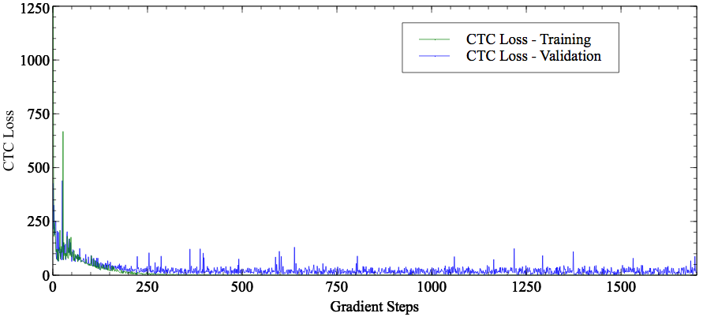
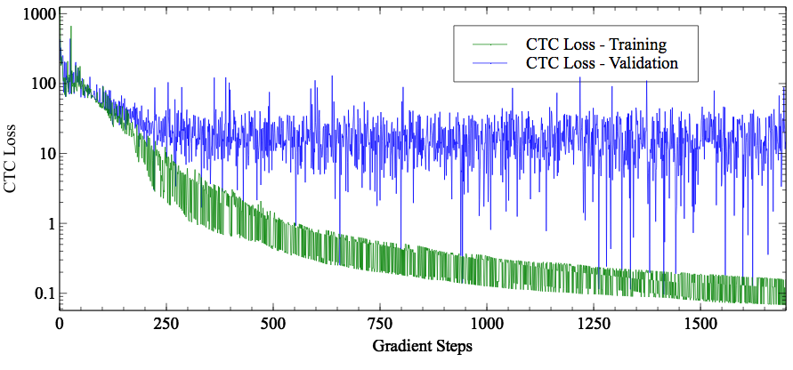
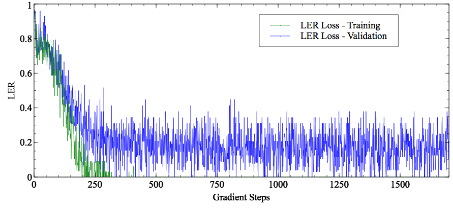

# Tensorflow CTC Speech Recognition
- Application of Connectionist Temporal Classification (CTC) for Speech Recognition (Tensorflow 1.0) 
- On the VCTK Corpus (same corpus as the one used by WaveNet).

## How to get started?
```bash
git clone https://github.com/philipperemy/tensorflow-ctc-speech-recognition.git ctc-speech
cd ctc-speech
pip3 install -r requirements.txt # inside a virtualenv

# Download the VCTK Corpus here: http://homepages.inf.ed.ac.uk/jyamagis/page3/page58/page58.html
# OR use this file (~65MB) that contains all the utterances for speaker p225.
wget https://www.dropbox.com/s/xecprghgwbbuk3m/vctk-pc225.tar.gz
tar xvzf vctk-pc225.tar.gz && rm -rf vctk-pc225.tar.gz
python generate_audio_cache.py --audio_dir vctk-p225


wget http://homepages.inf.ed.ac.uk/jyamagis/release/VCTK-Corpus.tar.gz # 10GB!l
python3 ctc_tensorflow_example.py # to run the experiment defined in the section First Experiment.
```

You can also download only the relevant files here [https://www.dropbox.com/s/xecprghgwbbuk3m/vctk-pc225.tar.gz?dl=1](https://www.dropbox.com/s/xecprghgwbbuk3m/vctk-pc225.tar.gz?dl=1) (~69MB). Thanks to @Burak Bayramli.

## Requirements
- **dill**: improved version of pickle
- **librosa**: library to interact with audio wav files
- **namedtupled**: dictionary to named tuples
- **numpy**: scientific library
- **python_speech_features**: extracting relevant features from raw audio data
- **tensorflow**: machine learning library
- **progressbar2**: progression bar

## First experiment

The code to reproduce this experiment is no longer in the latest commit.

```
git checkout ba6c10fba2383cd4933d47896f95d30248458161
```

### Set up
Speech Recognition is a very difficult topic. In this first experiment, we consider:
- A very small subset of the VCTK Corpus composed of only one speaker: p225.
- Only 5 sentences of this speaker, denoted as: 001, 002, 003, 004 and 005.

The network is defined as:
- One LSTM layer `rnn.LSTMCell` with 100 units, completed by a softmax.
- Batch size of 1.
- Momentum Optimizer with learning rate of 0.005 and momentum of 0.9.

The validation set is obtained by constantly truncating the audio files randomly at the beginning (between 0 and 125ms max). We make sure that we do not cut when the speaker is speaking. Using 5 unseen sentences would be more realistic, however, it's almost impossible for the network to pick it up since a training set of only 5 sentences is way too small to cover all the possible phonemes of the english language. By truncating randomly the silences at the beginning, we make sure that the network does not learn the mapping audio from sentence -> text in a dumb way.


### Results

Most of the time, the network can guess the correct sentence. Sometimes, it misses a bit but still encouraging.

Example 1
```
Original training: diving is no part of football
Decoded training: diving is no part of football
Original validation: theres still a bit to go
Decoded validation: thers still a bl to go
Epoch 3074/10000, train_cost = 0.032, train_ler = 0.000, val_cost = 9.131, val_ler = 0.125, time = 1.648
```

Example 2
```
Original training: three hours later the man was free
Decoded training: three hours later the man was free
Original val: and they were being paid 
Decoded val: nand they ere being paid  
Epoch 3104/10000, train_cost = 0.075, train_ler = 0.000, val_cost = 2.945, val_ler = 0.077, time = 1.042
```

Example 3
```
Original training: theres still a bit to go
Decoded training: theres still a bit to go
Original val: three hours later the man was free
Decoded val: three hors late th man wasfree
Epoch 3108/10000, train_cost = 0.032, train_ler = 0.000, val_cost = 12.532, val_ler = 0.118, time = 0.859
```

<p align="center">
  <b>CTC Loss</b><br>
  
</p>

<p align="center">
  <b>CTC Loss (Log scale)</b><br>
  
</p>
CTC Loss is the raw loss defined in the paper by Alex Graves.

<p align="center">
  <b>LER Loss</b><br>
  
</p>
LER (Label Error Rate) measures the inaccuracy between the predicted and the ground truth texts.

Clearly we can see that the network learns very well on just 5 sentences! It's far from being perfect but quite appealing for a first try.

## Second experiment

- LSTM with 256 cells.
- Only one speaker: p225.
- 15 shortest utterances used as testing set.
- Rest used as training set.
- Can now define a batch size different than 1.

```
Epoch 2723/3000, train_cost = 1.108, train_ler = 0.000, val_cost = 59.116, val_ler = 0.467, time = 2.559
- Original (training) : but the commission is on a collision course with the government 
- Decoded  (training) : but the commission is on a collision course with the government 
- Original (training) : this action reflects a slump in bookings 
- Decoded  (training) : this action reflects a slump in bookings 
- Original (training) : they had to learn to work from the consumer back 
- Decoded  (training) : they had to learn to work from the consumer back 
- Original (training) : it depends on the internal discussions in the ministry of defence 
- Decoded  (training) : it depends on the internal discussions in the ministry of defence 
- Original (training) : irvine said his company was intent on supporting the scottish dairy industry 
- Decoded  (training) : irvine said his company was intent on supporting the scottish dairy industry 
- Original (training) : the pain was almost too much to bear 
- Decoded  (training) : the pain was almost too much to bear 
- Original (training) : this is a very common type of bow one showing mainly red and yellow with little or no green or blue 
- Decoded  (training) : this is a very common type of bow one showing mainly red and yellow with little or no green or blue 
- Original (training) : in fact he should never have been in the field 
- Decoded  (training) : in fact he should never have been in the field 
- Original (training) : saddam is not the only example of evil in our world 
- Decoded  (training) : saddam is nat the only example of evil in our world 
- Original (training) : so did she meet him  
- Decoded  (training) : so did she meet him  
- Original (validation) : it is a court case 
- Decoded  (validation) : it is a cot ase    
```

<p align="center">
  <b>LER Loss</b><br>
  
</p>

This experiment is interesting. The network seems to generalize a bit on unseen audio files (of the same speaker). I didn't expect the network to perform well on such a small dataset. However, let's keep in mind that the generalization power is quite poor here. It's overfitting as well.

## Special Thanks
- Igor Maceda for providing the basic scripts here [ctc_tensorflow_example](https://github.com/igormq/ctc_tensorflow_example)
